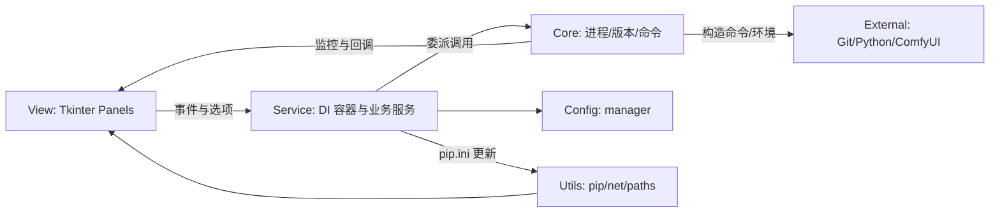

# ComfyUI 启动器
> 版本：v1.0.1

一个专为 ComfyUI 设计的图形化启动器，提供便捷的启动选项管理与版本更新。

## 功能特性

### 核心功能
- **多模式启动**: 支持多种启动配置（CPU、GPU、镜像源等）
- **版本信息**: 显示 ComfyUI、前端、模板库、Python、Torch 版本
- **批量更新**: 一键选择并更新内核/前端/模板库
- **配置管理**: 保存和管理启动参数配置

### 版本与更新
- 获取并展示版本信息
- 选择更新项目并执行批量更新
- 支持快速刷新状态

## 使用说明

### 启动启动器
```bash
# 在项目根目录运行（增强版界面）
python comfyui_launcher_enhanced.py

# 或直接运行已打包的可执行文件（若已构建）
# 双击项目根目录下的 ComfyUI启动器.exe
```

### 使用流程
- 启动后，启动器会自动读取 `launcher/config.json`：
  - `paths.comfyui_path`：作为 ComfyUI 根目录；若未配置或无效，会弹窗提示选择 ComfyUI 根目录（包含 `main.py` 或 `.git`）。选择后会保存到配置文件。
  - `paths.python_path`：作为 Python 可执行路径；若未配置或无效，会按常见候选自动解析（如 `python_embeded/python.exe`）。
- 在“启动与更新”页配置启动选项（CPU/GPU、端口、CORS、镜像与代理等）。
- 点击“一键启动”，启动器会按配置构造命令并启动 ComfyUI。
- 若设置了镜像或代理，会注入相关环境变量（如 `HF_ENDPOINT`、`GITHUB_ENDPOINT`）。
- 检测到便携版 Git（`tools/PortableGit/bin/git.exe`）时，会在启动时注入 `GIT_PYTHON_GIT_EXECUTABLE` 并前置其 `bin` 到 `PATH`，无需手动设置系统环境。
 - 若目标端口已被占用，启动器会提示是否直接打开网页而不启动新的实例；默认取消启动。
 - 点击“停止”，会直接终止占用当前设置端口（默认 `8188`）的所有相关进程。
 - 关闭窗口时，自动执行与“停止”一致的逻辑后退出。

### 快速操作
- 一键启动 ComfyUI
- 打开根/日志/输入/输出/插件目录
- 切换计算模式与网络选项

### 启动选项
- 选择启动模式（从现有 .bat 文件解析）
- 配置自定义启动参数
- 保存常用配置

### 调试模式与日志
- 默认情况下，命令输出日志被严格收敛：每次命令的 `stdout`/`stderr` 最多记录少量行（默认 10 行），`netstat -ano` 仅记录行数摘要，避免日志膨胀。
- 开启调试模式：在 `launcher` 目录创建一个文件 `is_debug`（内容随意，如 `debug`）。存在该文件时，日志级别提升为 `DEBUG`，命令输出将更详细（按字符截断，默认 4000 字）。
- 关闭调试模式：删除 `launcher/is_debug` 文件即可恢复到普通模式。
- 可选高级调节：
  - 非调试模式下的每次输出行数上限可通过环境变量 `COMFYUI_LAUNCHER_LOG_LINES_LIMIT` 设置，例如：`5`。
  - 调试模式下的字符截断长度可通过 `COMFYUI_LAUNCHER_LOG_OUTPUT_LIMIT` 设置，例如：`2000`。
  - 配置文件 `launcher/config.json` 中的 `advanced.show_debug_info` 为 `true` 时，会自动创建 `launcher/is_debug` 文件以便开启调试模式（不会自动删除你手动创建的标记文件）。

## 项目结构

```
ComfyUI-Mie-Package-Launcher/
├── assets/                      # 图标与图片资源
├── config/                      # 配置管理器
│   └── manager.py
├── core/                        # 核心能力（进程、版本、命令构建、监控）
│   ├── process_manager.py
│   ├── version_service.py
│   ├── launcher_cmd.py
│   ├── runner_start.py
│   ├── runner_stop.py
│   ├── runner.py
│   ├── probe.py
│   └── kill.py
├── docs/                        # 接口契约与补充文档
│   └── ServiceInterfaces.md
├── services/                    # 业务服务层（依赖注入）
│   ├── di.py
│   ├── process_service.py
│   ├── version_service.py
│   ├── update_service.py
│   ├── config_service.py
│   ├── git_service.py
│   ├── network_service.py
│   └── runtime_service.py
├── tests/                       # 单元与集成测试
│   ├── unit/
│   └── integration/
├── ui/                          # 视图层（Tkinter）
│   ├── layout.py
│   ├── version_panel.py
│   ├── launch_controls_panel.py
│   ├── network_panel.py
│   ├── start_button_panel.py
│   ├── about_tab.py / launcher_about_tab.py
│   └── helpers.py / events.py / theme.py
├── utils/                       # 通用工具
│   ├── common.py / logging.py
│   ├── paths.py / pip.py / net.py
│   └── ui_actions.py
├── comfyui_launcher_enhanced.py # 应用入口（View+Controller）
├── requirements.txt             # 依赖说明（主要标准库 + 可选）
└── README.md
```

### 主要模块与功能
- `comfyui_launcher_enhanced.py`：应用入口，初始化 `VersionManager` 与 `ProcessManager`，构建 UI 并注入 `ServiceContainer`。
- `ui/*`：界面布局与交互面板，绑定 `tk.StringVar/BooleanVar` 并触发服务层方法。
- `services/*`：封装更新、Git、网络、运行时、配置等业务，向 `core/*` 委派具体执行。
- `core/*`：启动/停止/监控子进程、刷新版本信息、构建启动参数与环境变量。
- `utils/*`：pip 安装与查询、路径解析、网络代理、日志与通用方法。
- `tests/*`：`unittest` 编写的单元与集成测试，覆盖关键路径与异常分支。

## 架构与数据流（View / Service / Core）



### 职责划分
- View 层：负责 UI 构建与用户操作，仅触发服务方法，不直接进行安装/更新/文件写入。
- Service 层：定义稳定接口，执行业务流程（更新、代理、配置、运行时准备），调用 Core 与 Utils。
- Core 层：执行系统层面操作（子进程、端口探测、版本刷新），通过回调更新 UI 状态。

### 关键调用关系
- 入口初始化服务容器：`comfyui_launcher_enhanced.py:200` 调用 `ServiceContainer.from_app(self)`。
- 启动流程：`core/process_manager.py:111` 构造命令 → `core/runner_start.py` 启动 → `core/runner.py` 监控 → UI 大按钮状态更新。
- 版本刷新：`core/version_service.py:6` 异步查询版本，使用 `app.root.after` 安全更新 `StringVar`。
- 代理设置：View 调用 `apply_pip_proxy_settings()` → `services/network_service.py` 写入 `pip.ini`（`utils/net.py`）。

### 数据流向
- 配置：入口解析并写入 `comfyui_path/python_path` → `config/manager.py` 负责读写与更新。
- UI→Core：选项与输入经 Service 汇总 → `core/launcher_cmd.py` 生成命令与环境 → 启动与监控。
- Core→UI：进程事件与版本信息通过 `after` 回调更新 UI（状态文本与可用性）。

## 注意事项

1. 启动器可在任意目录运行；首次或路径无效时会弹窗选择 ComfyUI 根目录。当前版本使用 `launcher/config.json` 保存解析后的 `comfyui_path` 与 `python_path`、端口与 UI 设置等。
2. “停止”与“退出”会直接终止占用配置端口的相关进程；若该端口被其他程序使用，也会被结束，请谨慎设置端口。
3. 端口被占用时，点击“一键启动”将提示是否直接打开网页而不启动新的实例。

## 环境要求

- 操作系统：Windows 10/11
- Python：3.8+（推荐 3.10/3.11）
- 依赖：主要使用标准库；打包需要 `pyinstaller>=5.0.0`
- 可选依赖：
  - `psutil`（端口与进程探测更健壮，`core/process_manager.py` 自动回退）
  - `requests`（便捷进行 API 示例调用）
  - `Pillow`（`ui/launcher_about_tab.py` 中用于图像资源显示）

### 测试环境配置
- 测试使用 `unittest` 与 `mock`，无需额外依赖。
- 部分 GUI 交互在测试中被模拟/跳过，推荐在本地 Windows 环境运行以保持一致性。

## 开发说明

本启动器主要使用 Python 标准库开发，无需额外安装依赖包。如需扩展功能，可参考 `requirements.txt` 中的可选依赖。

## 打包 EXE

支持使用 PyInstaller 将启动器打包为独立的 `ComfyUI启动器.exe`。

### 环境准备
- 安装 PyInstaller（推荐使用项目内的嵌入式 Python）：
  - Windows PowerShell：
    - ``python -m pip install pyinstaller``

### 方式一：使用脚本构建（推荐）
- 在项目根目录运行：
  - ``python build_exe.py``（默认构建完整版启动器）
- 构建完成后，脚本会将 `dist\ComfyUI启动器.exe` 拷贝到项目根目录为 `ComfyUI启动器.exe`。

### 方式二：使用 spec 文件构建
- 直接在项目根目录：
  - ``pyinstaller ComfyUI启动器.spec``（窗口模式，图标与资源已配置）

### 构建产物位置
- `dist\ComfyUI启动器.exe`（PyInstaller 默认输出）
- 项目根目录的 `ComfyUI启动器.exe`（使用脚本时会自动复制）

### 说明与提示
- 打包脚本内置常用的 `hidden-import` 与 `exclude-module` 配置，适配 Windows 环境与 Tkinter GUI。
- 若你希望自定义图标，替换 `launcher\rabbit.ico` 即可。
- 调试日志可通过在 `launcher` 目录下创建 `is_debug` 文件开启；打包后的 EXE 同样支持该开关。
## 模块化重构说明

- 新的目录结构：
  - `core/` 核心功能（进程管理、版本管理等）
  - `ui/` 界面组件与资源（主题、面板、图标辅助等）
  - `utils/` 工具函数（路径解析、pip 操作、网络代理、通用方法、日志）
  - `config/` 配置管理器
  - `services/` 服务层（业务逻辑、依赖注入与契约）

- 主要迁移：
  - `process_manager.py` → `core/process_manager.py`
  - `version_manager.py` → `core/version_manager.py`
  - `logger_setup.py` → `utils/logging.py`
  - `paths.py` → `utils/paths.py`
  - `pip_utils.py` → `utils/pip.py`
  - `net_utils.py` → `utils/net.py`
  - `utils.py` → `utils/common.py`
  - `assets.py` → `ui/assets_helper.py`
  - View → Service：`update_frontend`、`update_template_library`、`resolve_git`、`_apply_manager_git_exe`、`apply_pip_proxy_settings`、`pre_start_up` 迁移到 `services/*`

- 入口保持不变：`comfyui_launcher_enhanced.py` 仍为应用入口，内部已更新为新的模块导入。

## 架构与设计理念（View / Service 分层）

- 目标：降低耦合、提升可测试性与可维护性；View 专注 UI，Service 专注业务
- 依赖注入：通过 `services/di.py: ServiceContainer.from_app(app)` 提供统一服务实例
- 服务职责：
  - `UpdateService`：前端与模板库更新、批量更新
  - `GitService`：Git 解析与配置写入 ComfyUI-Manager
  - `NetworkService`：PyPI 代理写入 `pip.ini`
  - `RuntimeService`：启动前运行时准备（模板目录确保）
  - `ConfigService`：配置加载/保存/更新与点分隔键访问
- 向后兼容：入口方法签名与对外行为保持稳定（例如 `get_version_info`、启动/停止逻辑等）

## 测试

### 覆盖范围与策略
- 覆盖 Service 层的更新、Git 写入、网络代理、运行时准备与配置读写。
- 覆盖 Core 的命令组合、端口探测、启动/停止与异常分支。
- 策略：大量使用 `unittest.mock` 隔离外部依赖（Git/Python/网络），对线程使用 Stub 加速与确定性验证。

### 运行方法
```bash
# 运行全部单元与集成测试
python -m unittest discover -s tests -p "test_*.py" -v

# 或仅运行常用单元测试
python -m unittest -v tests\unit\test_services.py tests\unit\test_core_tools.py tests\unit\test_launcher.py
```

### 测试报告
- 可选安装 `coverage` 生成覆盖率报告：
```bash
python -m pip install coverage
coverage run -m unittest discover -s tests -p "test_*.py"
coverage html  # 生成 htmlcov/index.html
```
- 运行后将生成 `.coverage` 文件（已在项目根目录），可用于聚合统计与可视化。

## 开发者指南

- 提交前检查：
  - View 不直接进行安装/更新/文件写入，统一使用 Service
  - 新增功能优先定义接口并编写单元测试
  - 避免在日志中打印过长输出，遵循现有限制

### 模块开发规范
- 新增功能先定义 Service 接口与返回结构，再在 View 绑定事件。
- 避免在 View 层进行耗时或有副作用的操作（安装/更新/写文件）。
- Core 层对外通过稳定函数暴露能力，避免 UI 直接导入内部实现。
- 日志输出遵循现有精简策略（非调试模式仅记录摘要）。

### View 层约束
- 使用 `tk.StringVar/BooleanVar` 持有状态，跨线程更新通过 `root.after`。
- 事件处理只做参数收集与校验，将执行委派给 Service。

### Service 层约束
- 明确输入/输出契约，失败返回统一结构（`success/updated/up_to_date/version/error`）。
- 调用 Core 与 Utils，避免直接操作 UI 控件或线程调度。

### 最佳实践示例
```python
# View 调用示例（comfyui_launcher_enhanced.py）
def apply_pip_proxy_settings(self):
    if getattr(self, 'services', None):
        self.services.network.apply_pip_proxy_settings()

# Service 委派示例（services/network_service.py）
def apply_pip_proxy_settings(self):
    net.apply_pip_proxy_settings(
        self.app.python_exec,
        self.app.pypi_proxy_mode.get(),
        self.app.pypi_proxy_url.get(),
        self.app.pip_proxy_url.get(),
        logger=self.app.logger,
    )

# 启动流程（core/process_manager.py）
def start_comfyui(self):
    cmd, env, run_cwd, py, main = build_launch_params(self.app)
    self.app.services.runtime.pre_start_up()
    run_start(self.app, self, cmd, env, run_cwd)
```

## API 调用示例

### 健康检查（可用于脚本集成）
```python
import requests
resp = requests.get("http://localhost:8188")
print(resp.status_code)  # 200 表示 ComfyUI Web 已就绪
```

### 提交工作流（ComfyUI 原生接口）
```bash
curl -X POST http://localhost:8188/prompt \
  -H "Content-Type: application/json" \
  -d '{"prompt": {}}'
```
> 注：具体 `prompt` 结构请参考 ComfyUI 官方文档与工作流导出的 JSON；启动器仅负责启动与环境配置，不对 API 进行二次封装。

## 文档
- 详细接口契约见 `docs/ServiceInterfaces.md`